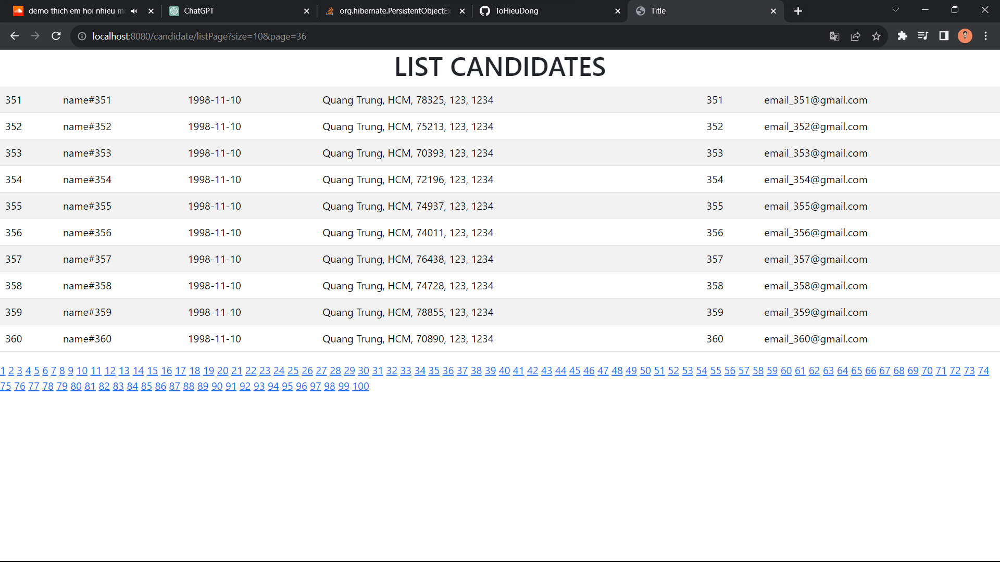
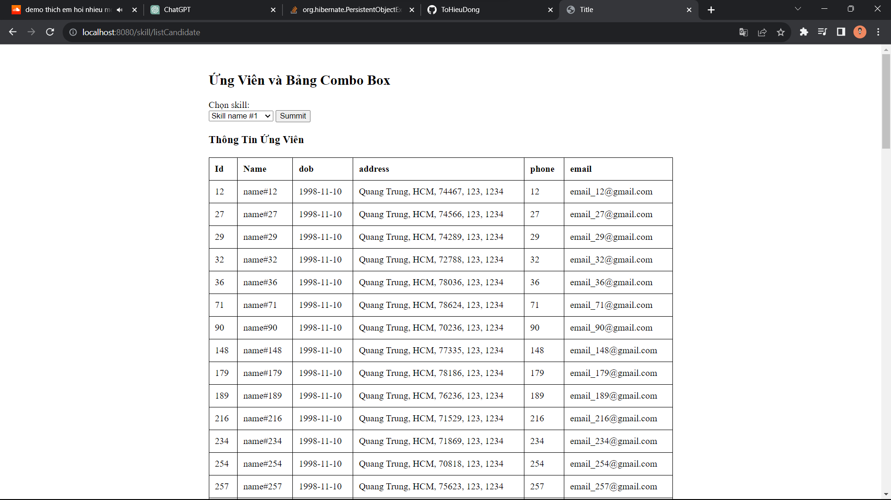

# 20046761_THLTWWW_WEEK 4 + 5
Bài tập tuần 4 + 5

## Yếu cầu:
1.	Tạo các enities sao cho khi thực thi sẽ tạo ra các bảng như hình
2.	Viết các repositories interface
3.	Viết các lớp services
4.	Tạo các trang web cho phép công ty đăng tin tuyển người với các skill mong muốn
5.	Các ứng viên khi log vào sẽ được gợi ý các công việc có skill phù hợp với mình


# Hiện các Candidate theo page
- 
# Tìm Candidate theo Skill
- Có 10 skill, tìm kiếm theo Skill bằng ComboBox

```
@PostMapping("/listCandidate")
    public String showCandidateListBySkill(Model model, @RequestParam("skillId") String skillId) {
        model.addAttribute("skills", skillRepository.findAll());
        Optional<Skill> skill = skillRepository.findById(Long.parseLong(skillId));
        if (skill.isPresent()) {

            List<CandidateSkill> list = candidateSkillRepository.findAllBySkill(skill.get());
            List<Candidate> candidateList = new ArrayList<>();
            for (CandidateSkill candidateSkill: list) {
                Optional<Candidate> candidate = candidateRepository.findById(candidateSkill.getCandidate().getCanId());
                if (candidate.isPresent())
                    candidateList.add(candidate.get());
            }
            model.addAttribute("candidates", candidateList);
            return "skills/skillSearch";
        }

        return "skills/skillSearch";
    }
```
- 
